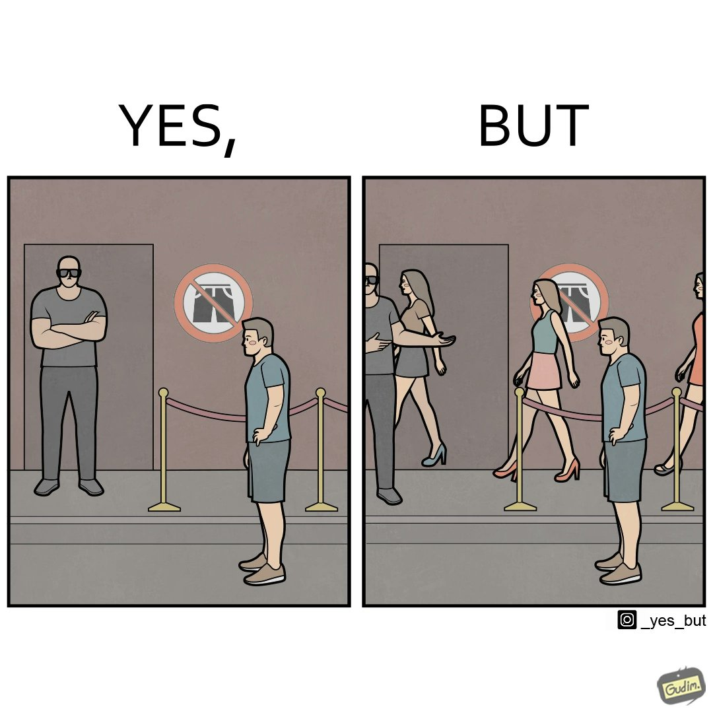
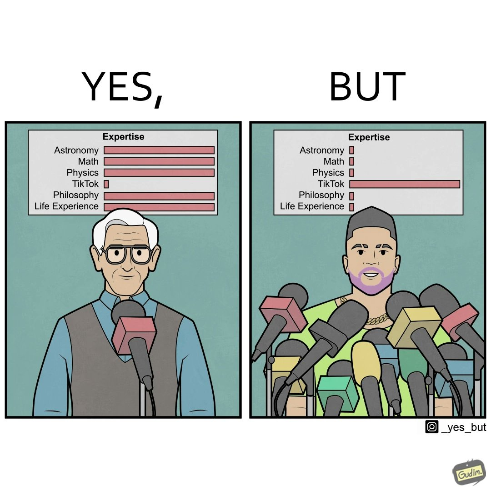
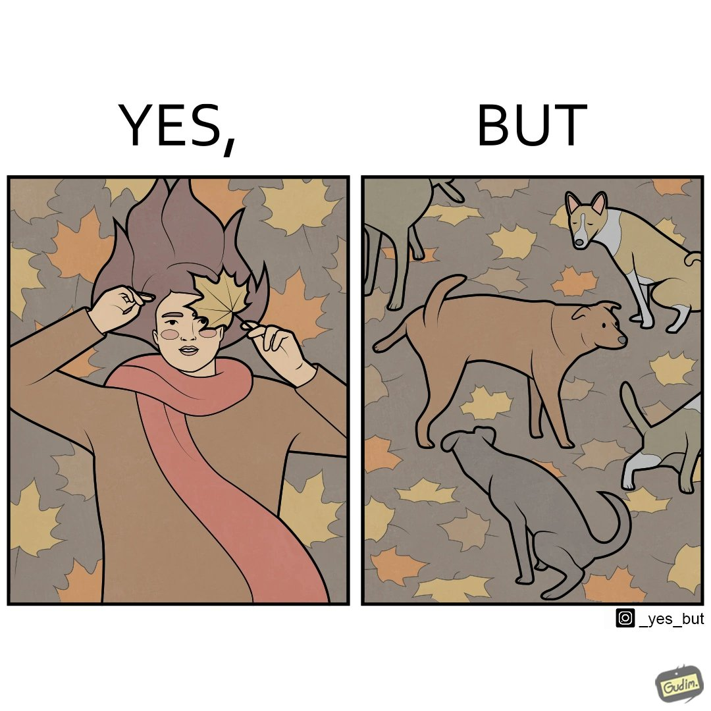
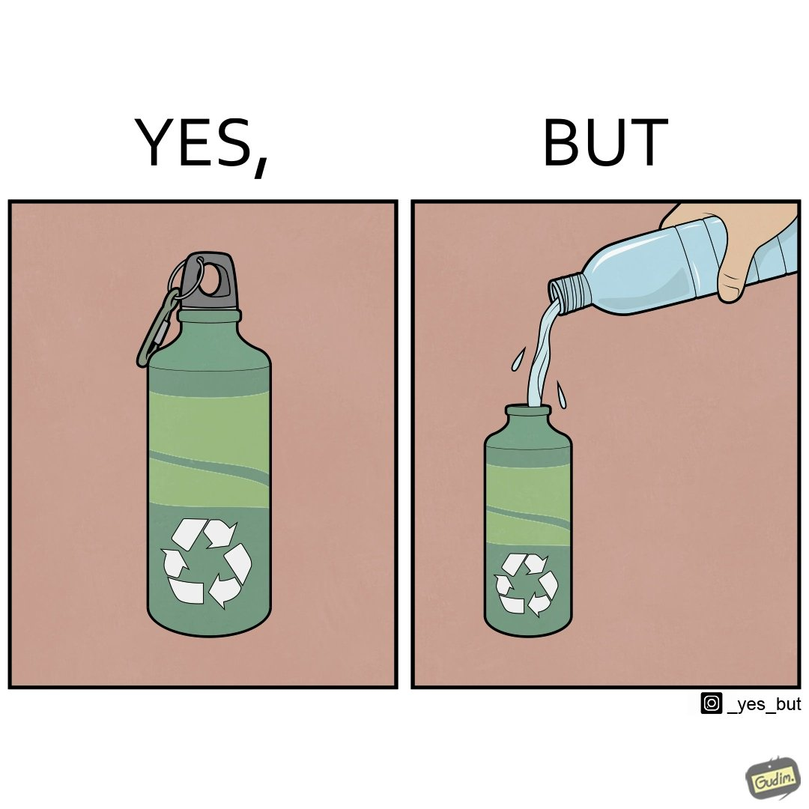
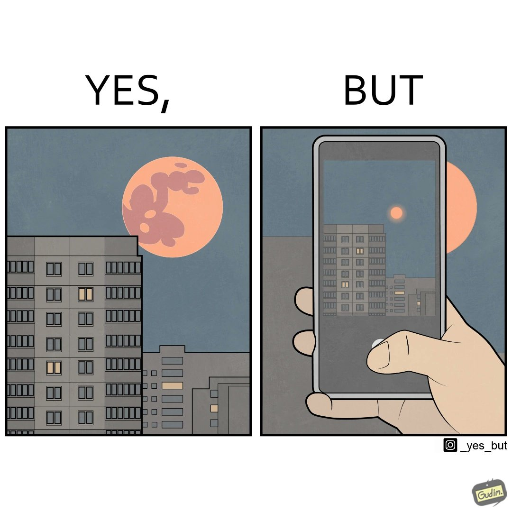
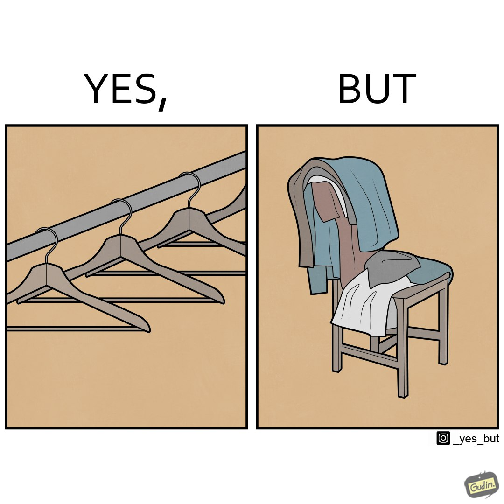
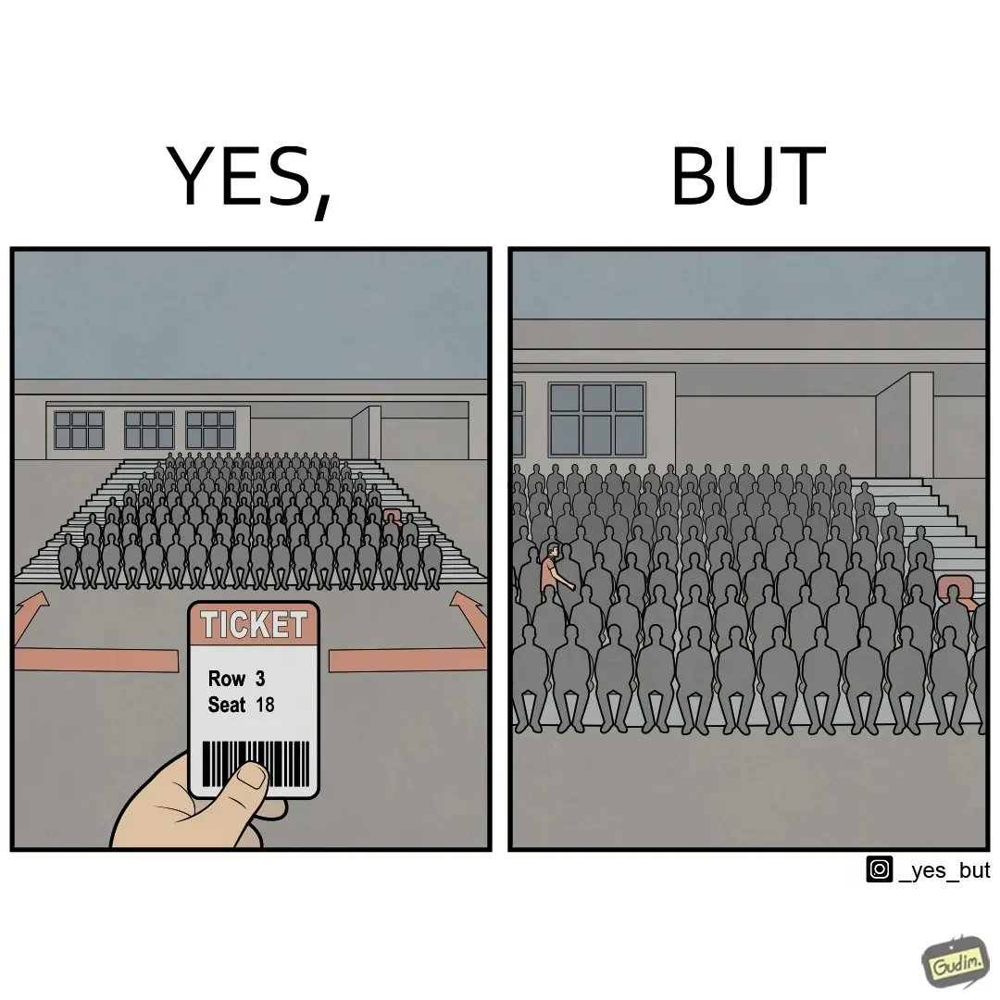
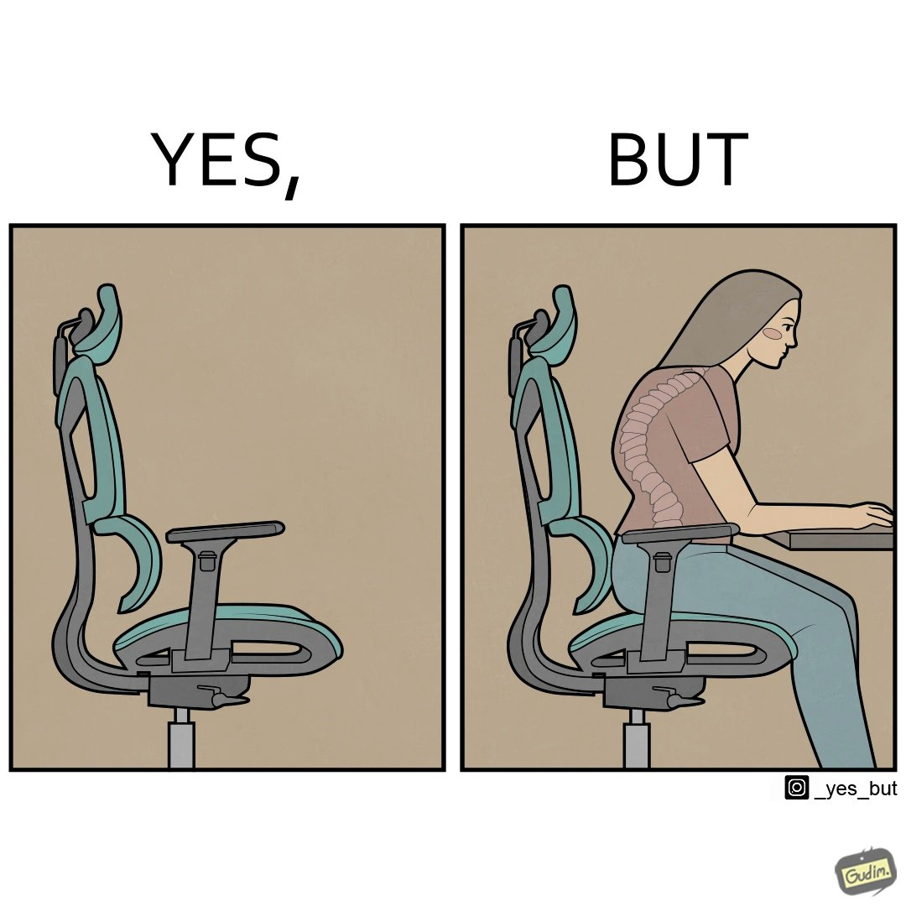
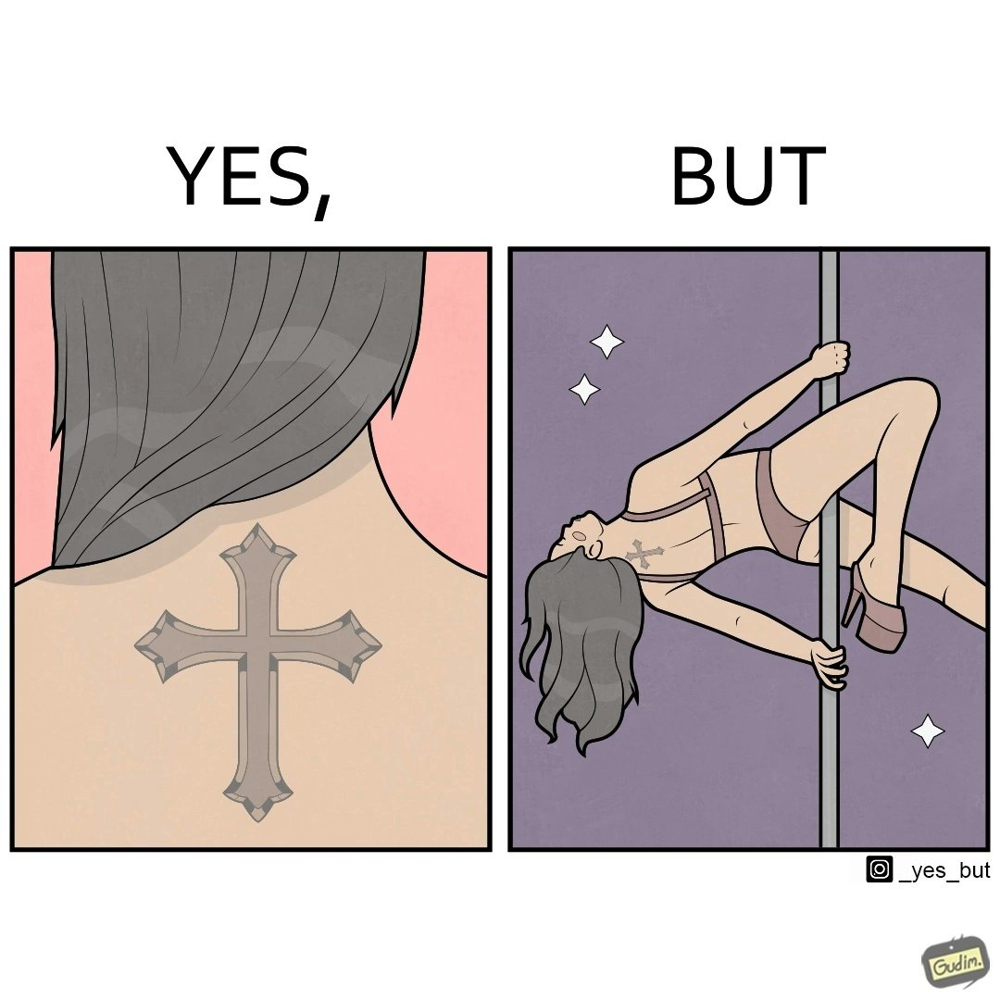

# Code for the paper - "***YesBut***: A High-Quality Annotated Multimodal Dataset for evaluating Satire Comprehension capability of Vision-Language Models"

https://drive.google.com/file/d/1s5K0FlUOKUKknhKh9runmjDKouIAVxwM/view?usp=sharing - contains the 283 images manually downloaded (and then manually filtered) from the posts in ‘X’ (erstwhile known as Twitter) handle @\_yesbut\_.

- `YesBut_Stage2_Annotation.csv` - Second Stage Annotation results for ***YesBut***
- Links for running the SOTA VL Models
  - `LLaVA` - https://github.com/haotian-liu/LLaVA
  - `MiniGPT4` - https://github.com/Vision-CAIR/MiniGPT-4
  - `Kosmos-2` - https://github.com/microsoft/unilm/tree/master/kosmos-2
  - `GPT4` - https://platform.openai.com/docs/guides/vision (We use `gpt-4-vision-preview` API)
  - `Gemini` - https://cloud.google.com/vertex-ai/generative-ai/docs/model-reference/gemini#gemini-1.0-pro-vision
- Links for calculating evaluation metric values for the Satirical Understanding Task
  - `BLEU` - https://huggingface.co/spaces/evaluate-metric/bleu
  - `METEOR` - https://huggingface.co/spaces/evaluate-metric/meteor 
  - `ROUGE-L` - https://pypi.org/project/py-rouge/ (F1-Score)
  - `BERTScore` - https://github.com/Tiiiger/bert_score
- `generate_using_dalle3.ipynb` - contains the code for generating images using DALL-E 3
- `Human_Eval_Results.csv` - contains Human Evaluation outcomes (majority vote per sample) of the Satirical Understanding Task on 30 images (10 images randomly sampled from each of Annotation Stages 2, 3, 4). Some columns and column headers are elaborated as follows - 
  - `image_filename` - correspond to images present in `human_eval_images` foider
  - For columns related to Appropriate Length, Correctness, Faithfulness, Visual Completeness, a blank value means that the annotator does not think that the corresponding aspect is being followed for the description.
  - `order_of_overall_img_descriptions` - this column contains the list of models (or whether it is humman-written) to which the 6 descriptions correspond to in that order. The values mean the following things -
    - `humanannotation` - Human-Written Description
    - `minigpt` - Description generated using MiniGPT4
    - `kosmos` - Description generated using Kosmos-2
    - `llava` - Description generated using LLaVA
    - `gpt4vision` - Description generated using GPT4
    - `gemini` - Description generated using Gemini    

## Predicted Overall Image Descriptions

### LLaVA

    

    The image is funny and satirical because it features a man and a woman in two different scenes, each with a different message. In one scene, the man is standing behind a roped-off area, seemingly watching the woman walk by. The other scene has the man and woman standing in front of a "Do Not Enter" sign, with the man looking on as the woman walks by. The contrast between the two scenes creates a humorous and ironic commentary on societal norms and expectations. The image also plays with the idea of the "other side" of the rope, which is

    

    

    The image is funny and satirical because it features a cartoon drawing of a man with a purple mohawk and glasses, surrounded by microphones, and the phrase "Expert, Astronomy" is displayed above him. This juxtaposition creates a humorous and ironic situation, as the man's appearance and occupation seem unrelated or even contradictory. The image likely intends to make a commentary on the absurdity of certain labels or assumptions people might make based on appearance or stereotypes.

    

    

    The image is funny and satirical because it features a person with a flower in their hair lying on the ground with several dogs surrounding them. The juxtaposition of the person and the dogs creates a humorous scene, as the person is seemingly trying to escape the dogs or simply relaxing in their presence. The image could be interpreted as a commentary on the relationship between humans and dogs, or it could be a playful representation of the human-animal bond. The fact that the person has a flower in their hair adds a whimsical touch to the scene, further emphasizing the lighthearted and

    

    

    The image is funny and satirical because it uses a common object, a water bottle, and combines it with a popular internet meme format, the "Yes, but" structure. The image juxtaposes a water bottle with the text "Yes, but" and a picture of water pouring from the bottle. This combination creates a humorous and lighthearted visual, making the viewer question the necessity of having a dedicated meme format for such a simple and everyday object. The humor lies in the absurdity of taking a simple object and turning it into a meme, as

    

    

    The image is funny and satirical because it shows a person taking a picture of a red moon with a cell phone, while the actual moon is seen in the background. This juxtaposition creates a humorous contrast between the person's perceived reality and the actual situation. It can also be interpreted as a commentary on the reliance on technology for capturing moments and the disconnection from the natural world.

    

    

    The image is funny and satirical because it uses a visual pun to represent the concept of shopping. The picture shows a clothes hanger with a jacket on it, and below it, there is a chair with a jacket hanging on it. This juxtaposition creates a humorous visual pun, as the clothes hanger and the chair appear to be doing the same thing, but with different objects. The image also uses the word "Yes" in one panel and "But" in the other, adding a layer of irony and humor to the scene. The image thus plays with the viewer'

    

    

    The image is funny and satirical because it shows a person holding a ticket to a stadium with a large number of empty seats. The caption "Yes, but" is displayed above the image, suggesting that despite the empty seats, the event is still happening. This contrasts with the actuality of the event being poorly attended, which is further emphasized by the person being the only one in the image. The humor comes from the irony of the situation and the contrast between the expectation of a crowded event and the actuality of an empty stadium.

    

    

    The image is funny and satirical because it presents a humorous and exaggerated scenario of a woman getting her teeth cleaned. The comic strip shows a woman holding a toothbrush in her mouth, and a person is injecting her with a syringe. This unusual combination of dental care and medical treatment creates a humorous and unexpected situation, as dental care typically does not involve the use of syringes. The comic strip plays with the contrast between these two activities, which are usually separate, and the absurdity of the situation adds to the humor.

    
    

    

    The image is funny and satirical because it presents a comical scenario of a woman sitting on a chair, looking over her shoulder, and typing on a computer. The scene is drawn in a comic strip style, with a split-screen showing the woman's back and the computer keyboard. The image is funny because it exaggerates the typical posture of a person using a computer, which can be seen as humorous or even ironic. The satire in the image lies in the representation of the woman's posture and the implied critique of the ergonomics and comfort of using a computer
