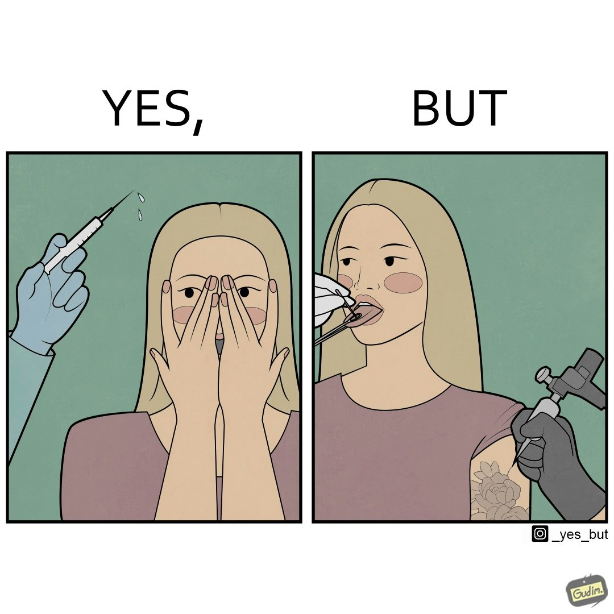

# Code for the paper - "***YesBut***: A High-Quality Annotated Multimodal Dataset for evaluating Satire Comprehension capability of Vision-Language Models"

## ***YesBut*** Dataset
- https://drive.google.com/file/d/1s5K0FlUOKUKknhKh9runmjDKouIAVxwM/view?usp=sharing - contains the 283 images manually downloaded (and then manually filtered) from the posts in ‘X’ (erstwhile known as Twitter) handle @\_yesbut\_.
- https://drive.google.com/file/d/1fHthLYNfcRFE4wEyWCMOUZHRVw3_ctNB/view?usp=sharing - Satirical Images annotated in Stage 3
- https://drive.google.com/file/d/1Tzs4OcEJK469myApGqOUKPQNUtVyTRDy/view?usp=sharing - Non-Satirical Images annotated in Stage 3
- https://drive.google.com/file/d/1YhXMEEiZnuv_VxORtEBR7JR3guhLBFjy/view?usp=sharing - Satirical Images annotated in Stage 4
- https://drive.google.com/file/d/1i4Fy01uBZ_2YGPzyVArZjijleNbt8xRu/view?usp=sharing - Non-Satirical Images annotated in Stage 4

## Files and relevant links

- `YesBut_Stage2_Annotation.csv` - Second Stage Annotation results for ***YesBut***
- Links for running the SOTA VL Models
  - `LLaVA` - https://github.com/haotian-liu/LLaVA
  - `MiniGPT4` - https://github.com/Vision-CAIR/MiniGPT-4
  - `Kosmos-2` - https://github.com/microsoft/unilm/tree/master/kosmos-2
  - `GPT4` - https://platform.openai.com/docs/guides/vision (We use `gpt-4-vision-preview` API)
  - `Gemini` - https://cloud.google.com/vertex-ai/generative-ai/docs/model-reference/gemini#gemini-1.0-pro-vision
- Links for calculating evaluation metric values for the Satirical Understanding Task
  - `BLEU` - https://huggingface.co/spaces/evaluate-metric/bleu
  - `METEOR` - https://huggingface.co/spaces/evaluate-metric/meteor 
  - `ROUGE-L` - https://pypi.org/project/py-rouge/ (F1-Score)
  - `BERTScore` - https://github.com/Tiiiger/bert_score
- `generate_using_dalle3.ipynb` - contains the code for generating images using DALL-E 3
- `Human_Eval_Results.csv` - contains Human Evaluation outcomes (majority vote per sample) of the Satirical Understanding Task on 30 images (10 images randomly sampled from each of Annotation Stages 2, 3, 4), along with the corresponding human-written as well as model-generated (by 5 SOTA VL Models) overall image descriptions. Some columns and column headers are elaborated as follows - 
  - `image_filename` - correspond to images present in `human_eval_images` foider
  - For columns related to Appropriate Length, Correctness, Faithfulness, Visual Completeness, a blank value means that the annotator does not think that the corresponding aspect is being followed for the description, and vice versa.
  - `order_of_overall_img_descriptions` - this column contains the list of models (or whether it is humman-written) to which the 6 descriptions correspond to in that order. The values mean the following things -
    - `humanannotation` - Human-Written Description
    - `minigpt` - Description generated using MiniGPT4
    - `kosmos` - Description generated using Kosmos-2
    - `llava` - Description generated using LLaVA
    - `gpt4vision` - Description generated using GPT4
    - `gemini` - Description generated using Gemini    

## Model-generated Overall Image Descriptions

### LLaVA

| Image                 | Description                             |
|-----------------------|-----------------------------------------|
|  | The image is funny and satirical because it features a man and a woman in two different scenes, each with a different message. In one scene, the man is standing behind a roped-off area, seemingly watching the woman walk by. The other scene has the man and woman standing in front of a "Do Not Enter" sign, with the man looking on as the woman walks by. The contrast between the two scenes creates a humorous and ironic commentary on societal norms and expectations. The image also plays with the idea of the "other side" of the rope, which is |
|  | The image is funny and satirical because it features a cartoon drawing of a man with a purple mohawk and glasses, surrounded by microphones, and the phrase "Expert, Astronomy" is displayed above him. This juxtaposition creates a humorous and ironic situation, as the man's appearance and occupation seem unrelated or even contradictory. The image likely intends to make a commentary on the absurdity of certain labels or assumptions people might make based on appearance or stereotypes. |
|  | The image is funny and satirical because it features a person with a flower in their hair lying on the ground with several dogs surrounding them. The juxtaposition of the person and the dogs creates a humorous scene, as the person is seemingly trying to escape the dogs or simply relaxing in their presence. The image could be interpreted as a commentary on the relationship between humans and dogs, or it could be a playful representation of the human-animal bond. The fact that the person has a flower in their hair adds a whimsical touch to the scene, further emphasizing the lighthearted and |
|  | The image is funny and satirical because it uses a common object, a water bottle, and combines it with a popular internet meme format, the "Yes, but" structure. The image juxtaposes a water bottle with the text "Yes, but" and a picture of water pouring from the bottle. This combination creates a humorous and lighthearted visual, making the viewer question the necessity of having a dedicated meme format for such a simple and everyday object. The humor lies in the absurdity of taking a simple object and turning it into a meme, as |
|  | The image is funny and satirical because it shows a person taking a picture of a red moon with a cell phone, while the actual moon is seen in the background. This juxtaposition creates a humorous contrast between the person's perceived reality and the actual situation. It can also be interpreted as a commentary on the reliance on technology for capturing moments and the disconnection from the natural world. |
|  | The image is funny and satirical because it shows a person holding a ticket to a stadium with a large number of empty seats. The caption "Yes, but" is displayed above the image, suggesting that despite the empty seats, the event is still happening. This contrasts with the actuality of the event being poorly attended, which is further emphasized by the person being the only one in the image. The humor comes from the irony of the situation and the contrast between the expectation of a crowded event and the actuality of an empty stadium. |
|  | The image is funny and satirical because it presents a humorous and exaggerated scenario of a woman getting her teeth cleaned. The comic strip shows a woman holding a toothbrush in her mouth, and a person is injecting her with a syringe. This unusual combination of dental care and medical treatment creates a humorous and unexpected situation, as dental care typically does not involve the use of syringes. The comic strip plays with the contrast between these two activities, which are usually separate, and the absurdity of the situation adds to the humor. |
|  | The image is funny and satirical because it presents a comical scenario of a woman sitting on a chair, looking over her shoulder, and typing on a computer. The scene is drawn in a comic strip style, with a split-screen showing the woman's back and the computer keyboard. The image is funny because it exaggerates the typical posture of a person using a computer, which can be seen as humorous or even ironic. The satire in the image lies in the representation of the woman's posture and the implied critique of the ergonomics and comfort of using a computer |

### Kosmos-2

| Image                 | Description                             |
|-----------------------|-----------------------------------------|
|  | The image is funny because it depicts a man standing in front of a closed door, seemingly ignoring the people in front, while the woman in front, who is wearing a dress, is walking through the door. The man's behavior is considered rude and inconsiderate, as he is not respecting the woman's privacy. The image conveys a sense of humor, as it pokes fun at the idea that people can be inconsiderate and ignore others' needs, even when they |
|  | The image is funny because it depicts an older man sitting in front of a row of microphones, asking a question to a young man who is wearing a mask. The older man is wearing glasses and has a beard, while the young man is not wearing a beard. The scene is set in front a podium, and the older man and the young boy are both wearing masks. This humorous scene is meant to poke fun at the idea that people often assume that older people are wiser |
|  | The image is funny because it depicts a woman with a scarf on, surrounded by cats, who are playing with her hair. The cats are playing around her, and the woman is trying to keep them away from her hair, which is a common occurrence in the context of cats and humans. |
|  | The image is funny because it shows a person pouring a bottle of water into a green plastic bottle, and then the person is seen pouring the water into a trash can. The image makes light of the fact that recycling is a common practice, but it also makes light on the fact there are still many people who don't recycle. |
|  | The image is funny because it depicts a person taking a picture of the moon with their phone, which is a common phenomenon in the context of the comic. The person is holding the phone up to the moon, capturing the moment and making it a shared memory. The scene is a combination of a person capturing the moon and the moon capturing the person. |
|  | The image is funny because it depicts a theater full of people, but it's also satirical because it'll make you think about the audience's behavior during a movie. In the image, a person is holding a sign that says \"Movies: Sold Out\" and is pointing at the empty seats. This suggests that the theater is full, but the audience is not showing up. The person is trying to make a point about the lack of interest in the movie, and the empty chairs are a reflection of that. |
|  | The image is funny because it depicts a woman sneezing into her hand, which is then being wiped with a tissue. This scene is a parody of the common scene where people sneeze into their hands, which can be perceived as a form of self-soothing or a way to avoid germs. The image also features a person with tattoos, and the juxtaposition of the two elements creates a humorous and relatable visual. |
|  | The image is funny because it depicts a woman sitting at a desk with her arms crossed, looking bored. The image is satirical because it is a parody of the classic \"office chair\" meme, which depicts a person sitting in a chair with their arms crossed and looking bored, as if they are waiting for someone to come and sit down. The woman in the image is not actually sitting in an office chair, but rather in a more relaxed position, which is a common stereotype of a bored person. |

### GPT4

| Image                 | Description                             |
|-----------------------|-----------------------------------------|
|  | This image is humorous because it showcases the inconsistency of rules and how they are enforced. The left panel shows a strictly enforced no-cap policy for a lone individual, while the right panel humorously contrasts this with a group blatantly disregarding the rule without consequence, highlighting the arbitrary or selective nature of rule enforcement. It plays on the "rules for thee but not for me" motif, pointing out hypocrisy or illogical exceptions in a playful manner. |
|  | The image is humorous because it shows an exaggerated contrast between two individuals' expertise levels across various disciplines, with one having significantly more experience and knowledge in each area. The satirical point lies in suggesting that sometimes people with lesser expertise might present themselves as equally or more knowledgeable, often leading to comical or ironic situations. |
|  | The image plays on the dual meaning of the word "but(t)." The first panel shows a person confidently starting a statement with "YES," suggesting they're about to make a point. The next panel reveals a comedic twist with visuals of dog butts, punning on the expected "BUT" argument rebuttal with literal animal behinds, creating a visual pun and subverting the expected serious or argumentative follow-up. |
|  | This image is humorous because it plays on the concept of sustainability. The first panel shows a reusable bottle with the recycling symbol, suggesting eco-friendliness. The second panel humorously undermines this by showing the bottle being filled with plastic, indicating a contradictory action to the supposed environmental commitment, thus, highlighting the irony of sometimes superficial environmental efforts. |
|  | The image is humorous because it highlights a common modern experience: reality often seems less impressive when captured on a smartphone camera. The left panel shows a large, beautiful moon as seen by the naked eye, while the right panel shows the same scene through a phone camera, where the moon appears disappointingly small and less impactful. The contrast pokes fun at the limitations of technology in conveying true scale and beauty. |
|  | This image plays on the common frustration of attending an event with assigned seating, only to find that your seat is directly behind a pole or obstruction, blocking the view. It humorously exaggerates the issue by showing an entire audience perfectly aligned except for one obstructed seat, suggesting a comically unfortunate luck that the ticket holder has the only bad seat in the house. |
|  | The image seems to satirize the contradictory or conflicting attitudes towards health and safety. In the first panel, a person hesitates to get a vaccine shot, implying caution or skepticism. In contrast, the second panel shows the same person nonchalantly smoking, which is widely known to be harmful. The humor arises from the visual play on the word "shot," with the vaccine needle and the smoking gun, aligned with the text "YES, BUT," hinting at rationalizing one health risk while fearing another less risky action. |
|  | The image humorously comments on how people often do not use ergonomic chairs as intended. On the left, it says "YES," showing the chair's correct posture-supporting design. On the right, the word "BUT" indicates a common reality where the person slouches, negating the chair’s ergonomic benefits. The joke lies in the contrast between ideal use and actual user behavior. |

### Gemini

| Image                 | Description                             |
|-----------------------|-----------------------------------------|
|  |  The image is funny because it shows how double standards can be applied differently to different people. The bouncer lets a woman in who is wearing a dress but not a man who is wearing shorts, even though the dress code sign shows a picture of a man in shorts with a line through it. This implies that the bouncer is only enforcing the dress code for men and not for women. |
|  |  The image is funny because it shows how people with a lot of expertise in a particular subject will talk about it in a very technical and complicated way, using a lot of jargon, while people with less expertise in the same subject will talk about it in a more general and relatable way. |
|  |  This image is satirical because it shows the idealized version of autumn as seen on social media versus the reality of autumn with all the leaves covering the ground and dogs rolling around in them. The reality is not as aesthetically pleasing as the ideal. |
|  |  The image is funny because it shows the hypocrisy of some people who claim to be environmentally conscious but still use single-use plastic water bottles. The image shows a person pouring water from a plastic water bottle into a reusable metal water bottle. The text above the image says "Yes" and the text below the image says "But". This suggests that the person in the image is saying "Yes, I am environmentally conscious, but I still use plastic water bottles." The image is satirical because it highlights the fact that many people who claim to be environmentally conscious are not actually doing anything to help the environment. |
|  |  The image is funny because it shows how people are more interested in taking pictures of the moon with their phones than in actually looking at it. The image is a commentary on our obsession with technology and how it can sometimes prevent us from enjoying the simple things in life. |
|  |  The image is funny because the person holding the ticket looks very pleased with their seat assignment, while the image shows that there are plenty of open seats and the entire row is empty except for that one person. |
|  |  The image is funny because it shows how people are often more afraid of needles when they're getting a vaccination than they are when they're getting a tattoo, even though the tattoo needle is much larger and more painful. It's a satirical commentary on how people's fears are often irrational. |
|  |  The image is funny because it shows the difference between what people think they look like when they sit in an ergonomic chair and what they actually look like. It is poking fun at how people often think they are sitting in a chair with perfect posture when in reality they are hunched over and not sitting up straight. The image is satirical because it is making fun of the way people often try to appear more professional or put together than they actually are. |
